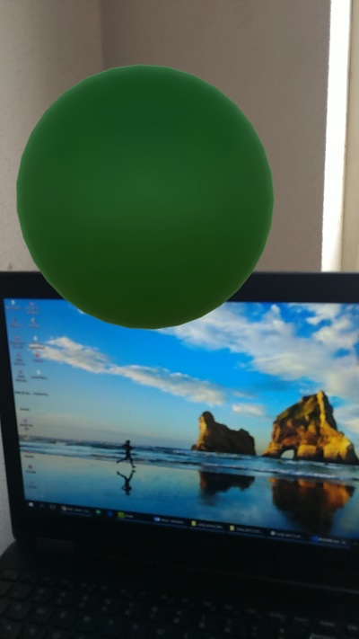

# arcore

Workshop materials: https://goo.gl/x8nsYK

Workshop results https://www.youtube.com/watch?v=vD5cMUSBW5U

Workshop description: https://codelabs.developers.google.com/codelabs/arcore-intro/index.html

Location AR Android: https://github.com/dat-ng/ar-location-based-android

## 1] Hello world

Code: 

Result: 

## 2] Track planes

## 3] Select plane

## 4] Add scoreboard

